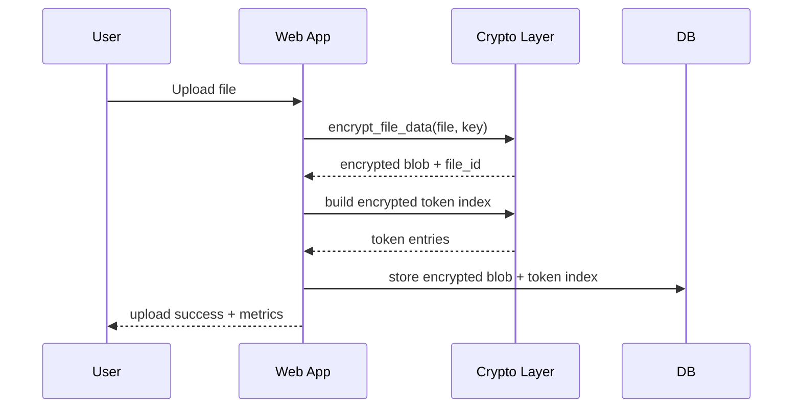
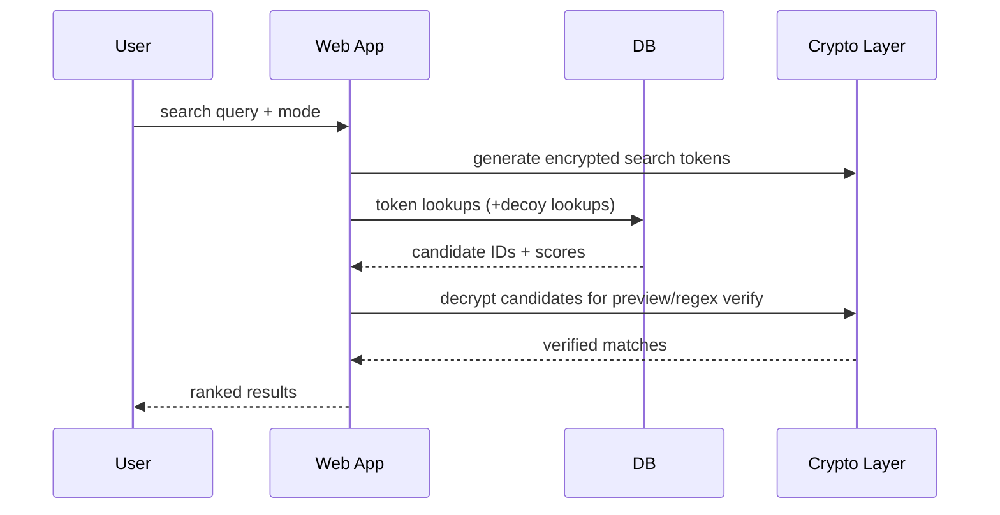

# Sequence Diagrams

## Login + 2FA + Key Session
```mermaid
sequenceDiagram
    participant U as User
    participant W as Web App
    participant A as Auth + Profile
    U->>W: POST username/password(+otp)
    W->>A: authenticate(username,password)
    A-->>W: user/profile
    W->>A: verify TOTP (if enabled)
    A-->>W: valid/invalid
    W->>W: derive master key; store session key marker
    W-->>U: dashboard or setup-2FA
```

## Upload -> Encrypt -> Index


## Search -> Candidate -> Verify

